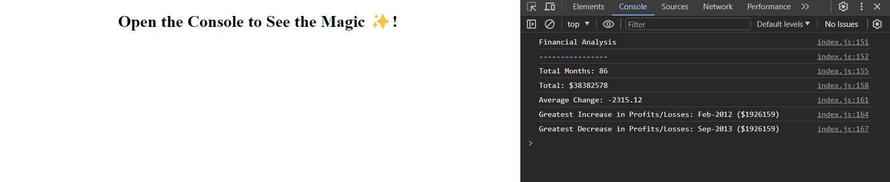

# Console Finances

**Console Finances** is a JavaScript project that demonstrates the understanding of core concepts like loops, conditionals, math functions, arrays, and iteration. In this project, a financial dataset is analyzed to extract valuable insights. This README file provides a comprehensive overview of the project, its motivations, technical implementation details, and the problems solved during its development.

## Overview

In this challenge, the project utilizes JavaScript skills to analyze the financial records of a company. A financial dataset has been provided in the `starter/index.js` file. The task was to create JavaScript code that analyzes the records to calculate the following:

- The total number of months included in the dataset.
- The net total amount of Profit/Losses over the entire period.
- The average of the **changes** in Profit/Losses over the entire period.
- The greatest increase in Profit/Losses (date and amount) over the entire period.
- The greatest decrease in Profit/Losses (date and amount) over the entire period.

## Motivations

1. **Financial Analysis:** This project serves as a practical application of JavaScript fundamentals for real-world problem-solving. It demonstrates the ability to manipulate and analyze data, which is a crucial skill in various industries,including web development.

2. **Algorithm Implementation:** The project showcases the ability to design and implement algorithms, particularly for data analysis tasks. It utilizes loops, conditionals, and math functions to extract valuable financial insights.

## What Was Done

1. **Data Analysis Algorithm:** The project includes a JavaScript algorithm that iterates through the financial dataset, calculating essential metrics such as the total number of months, net total amount, average change, and identifying the greatest increases and decreases.

2. **Code Documentation:** The code is well-documented, making it easy for others to understand and collaborate. Comments provided explain the approach and how each part of the code works.

## Problem Solved

1. **Financial Data Analysis:** This project addresses the need to analyze financial records efficiently. It automates the process of calculating key financial metrics, saving time and reducing the potential for human error.

2. **Pseudocode:** The project challenges algorithmic thinking, breaking down a complex problem into smaller, manageable steps using pseudocode.

## What Was Learned

Throughout the development of **Console Finances**, I gained valuable insights and skills, including:

- **Conditionals and Loops**: The project provided an opportunity to enhance proficiency in using conditionals (if statements) and loops (for loop) for precise decision-making and controlled iteration. Conditionals were employed to assess changes in profit and identify the highest and lowest values, while loops facilitated the systematic processing of financial data.

- **Arrays Manipulation and Iteration**: Working with the financial dataset involved in-depth knowledge of array manipulation and iteration. Skills in accessing, modifying, and traversing arrays were honed, enabling effective data analysis.

- **Data Analysis:** Practical experience in analyzing structured data using JavaScript, which is a fundamental skill for many applications, including data science and financial analysis.

- **Algorithm Design:** Understanding in designing efficient algorithms for specific tasks, such as calculating averages, finding maximum and minimum values, and iterating through data structures.

- **Documentation Best Practices:** Learning the importance of clear and organized code documentation to enhance collaboration and code maintainability. Proper commenting and code structuring practices were emphasized to facilitate teamwork and future updates.

## Usage

To run **Console Finances** and see the financial analysis results, follow these steps:

1. Clone the repository to your computer.

2. Copy the provided financial dataset into your local repository.

3. Open the project in a JavaScript environment (e.g., a browser's developer console) to execute the code.

4. View the resulting financial analysis in the console, which should resemble the example provided in the project instructions.

## Credits

This project was developed and is actively maintained by the project owner. The code can be found in the GitHub repository: [Console-Finances Repository](https://github.com/yourusername/Console-Finances).

## License

This project is provided under an open-source license, granting users the freedom to use, modify, and distribute the code.

## Links

## Links
- Deployed application: https://jimmygian.github.io/Console-Finances/
- Repository: https://github.com/jimmygian/Console-Finances/
